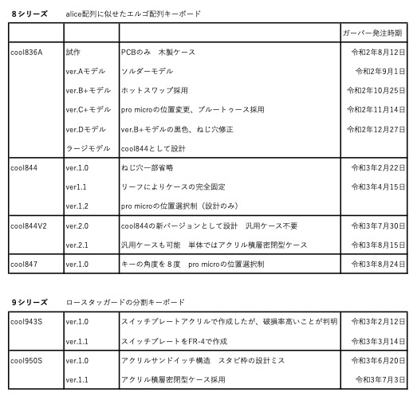

# Hello_keyboard

## ここではm.kiの試作中のものを保管しています。

### キーボード開発略史

### cool943S
これは令和２年１１月から開発を初めて、１２月末に完成した分割キーボードです。 
主な特徴は、次のとおりです。 
・40%キーボード 
・分割型（スプリット） 
令和３年中にkicadで設計する予定です。 
詳細は[こちら](https://github.com/telzo2000/Hello_keyboard/blob/main/cool943S/README.md)にあります。
 

### polypad
これは40PERCENT CLUBが設計したPOLYANDYです。TALP KEYBOARDさんが令和２年１２月下旬にプレゼントキャンペーンを実施し、m.kiが頂いたものです。 
qmk_firmwareに対応していなかったため、ちょうど、この時期にラズパイ環境下でqmk_firmwareが使えるようになったので、自分への課題として、自力でファームウェアを作りました。 
区分上、polypadと名付けました。 
 

### daughterboard for cool844
　これはcool844で使用するために、既存の部品を組み合わせて作ったものです。秋月電子通称で販売している「[ＵＳＢｔｙｐｅ－ＣコネクタＤＩＰ化キット（シンプル版エコノミータイプ）](https://akizukidenshi.com/catalog/g/gK-15426/)」と「[ケーブル取付用ＵＳＢコネクタ（ｍｉｃｒｏＢタイプ、オス）](https://akizukidenshi.com/catalog/g/gC-07666/)」をシリコンケーブル線で繋いだものです。これにより、pro microにおける抜き挿しの多様によるもげる状況を回避しつつ、USB Type-Cが使えるようになります。誰でも思いつくものです。「daughterboard for cool844」と名付けましたが、何の意味もなく、ただ、自分の中でわかりやすくしただけです。 
 作成方法は[こちら](https://github.com/telzo2000/Hello_keyboard/blob/main/dbforcool844/buildlog.md)になります。 

### アドベントカレンダー2020　15日目記事
初心者の自作キーボードの作り方をします。 
その１
https://github.com/telzo2000/Hello_keyboard/blob/main/selfmademykeyboard.md
 
その２
https://github.com/telzo2000/Hello_keyboard/blob/main/selfmademykeyboard2.md
 

### アドベントカレンダー2021 25日目記事
「poker互換の60％汎用キーボードケースを使用する自作キーボードに関する一考察-cool844における活用法-」
https://github.com/telzo2000/Hello_keyboard/blob/main/selfmademykeyboard3.md

