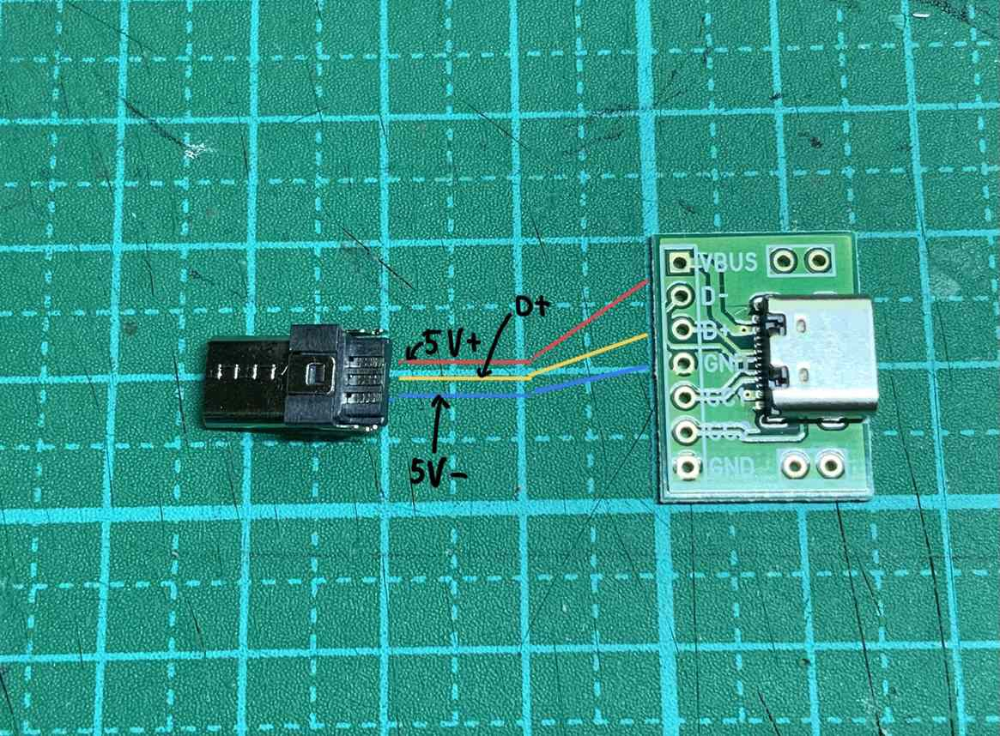
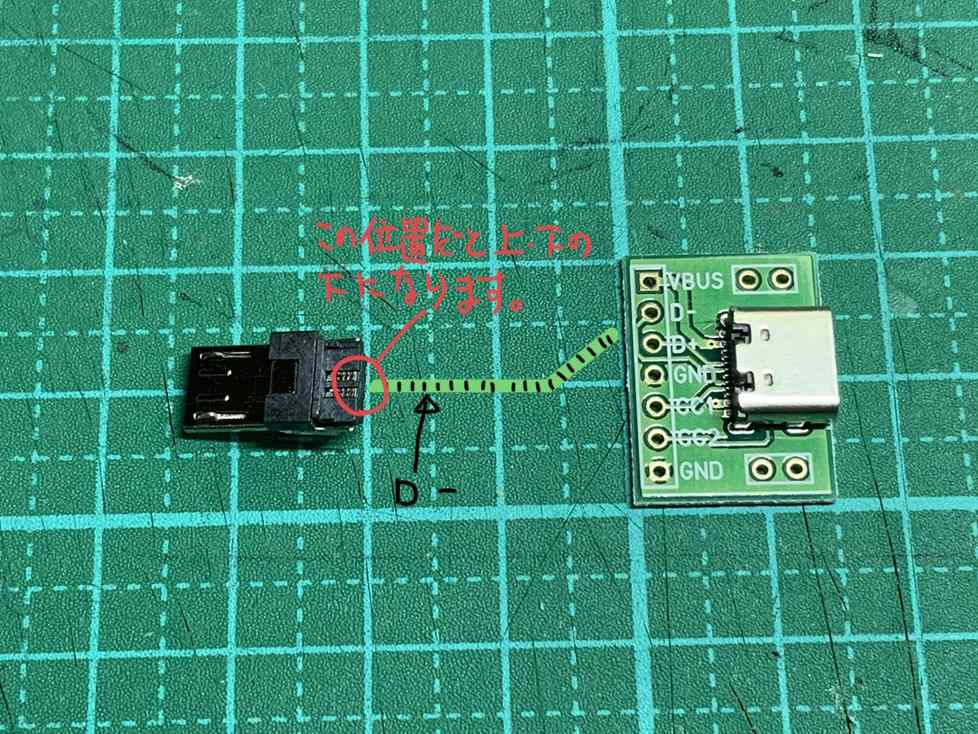
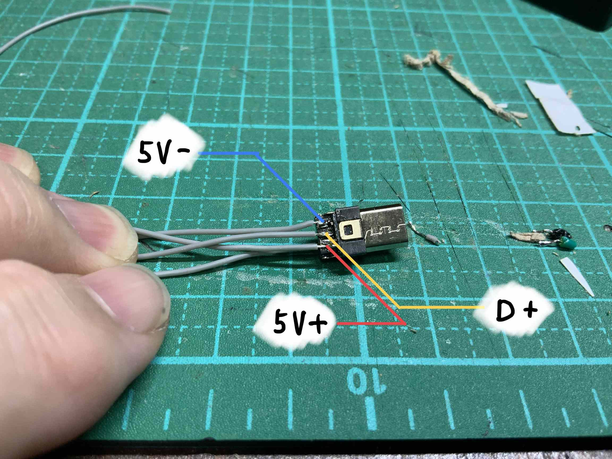
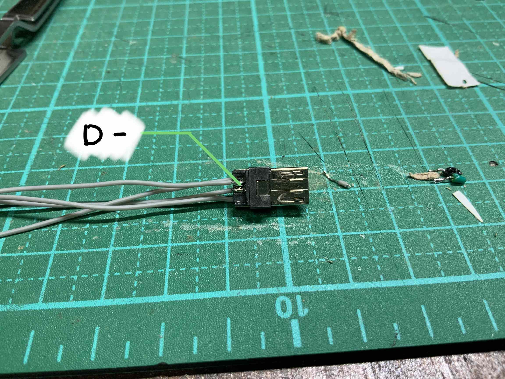
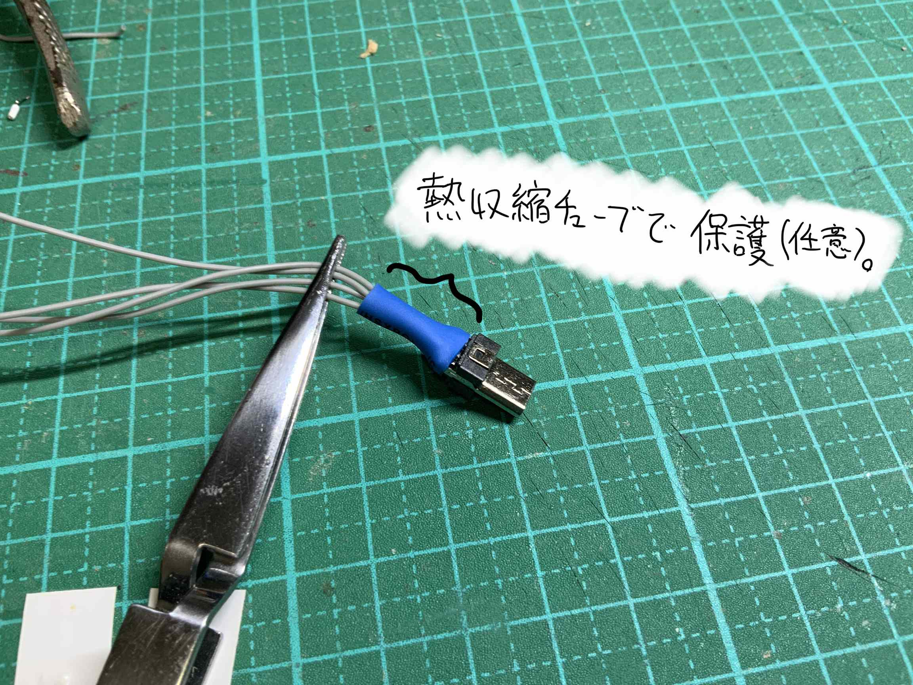

## daughterboard for cool844

### 作り方

#### 0 配線について
次の画像を参考にして、配線処理をしてください。 

※[アリエクスプレス](https://ja.aliexpress.com/wholesale?catId=0&initiative_id=SB_20210313043816&SearchText=4-pin+micro+male)では、マイクロUSB端子（オス）にケーブルが販売されているのを見つけました。 
細かいハンダ付け作業に苦手と感じる方は、この商品が良いと思います。検索語「4-pin micro male」で見つかると思います。ただし、くれぐれも自己責任で対応ください。 

#### 1 マイクロUSBへのケーブルのハンダ付け

 
画像を参考にハンダ付けをしてください。
とても細かい作業です。
最初にケーブルの先にハンダを少しつけておきます。
次にマイクロUSB端子（オス）の方にフラックスを多めに塗布します。
フラックスの中ではんだごてを当てて、ケーブル先のハンダを溶かすようにしてハンダ付けをしてください。はんだごての先は、Ｉ型を使用すると作業しやすいです。C型だとちょっと細かい作業に向かないかもしれません。 
 
こちら側で３箇所行います。

こちら側で１箇所行います。

任意ですが、ケーブル４本を含むように、熱収縮チューブを通しておくと、最後に、端子側のハンダ付けした箇所をガードすることができます。これは、全ての最後に行ってください。この段階でじっしすると、同色のケーブルの場合、どのケーブルがどこにハンダ付けしたかわからなくなる可能性があります。

 
### 2 ケーブルの反対側をUSB-Cの基板側へのハンダ付け

 
どのケーブルを、基板のどの部分に半田付けをするかは、次のご覧ください。 
基板＜ーーーーーーー＞端子 
VBUS  ＜ーーーーーー＞5V+ 
D- ＜ーーーーーーーー＞D- 
D+ ＜ーーーーーーーー＞D+ 
GND＜ーーーーーーー＞5V- 
 
基板にCC1、CC2、GNDが残りますが、今回は使いません。 
未検証ですが、キーボードとこの部品とを、USB-Cケーブル（両方ともUSB-Cのもの、途中で変換していない）を使用する場合、この３つの端子への処理が必要になります。 
 
これでdaughterboard for cool844の完成です。 

