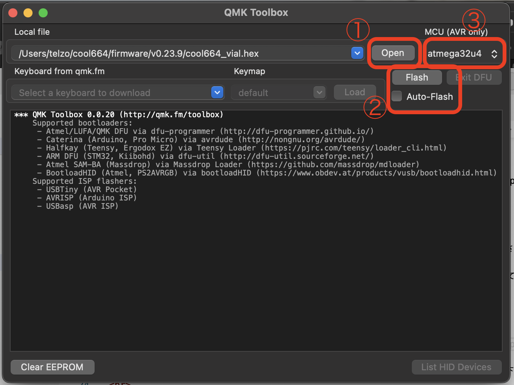
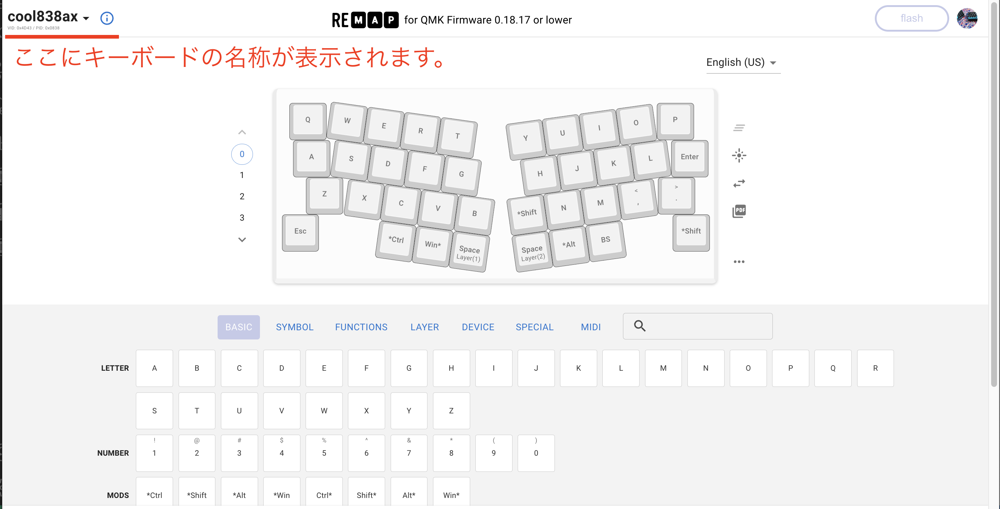
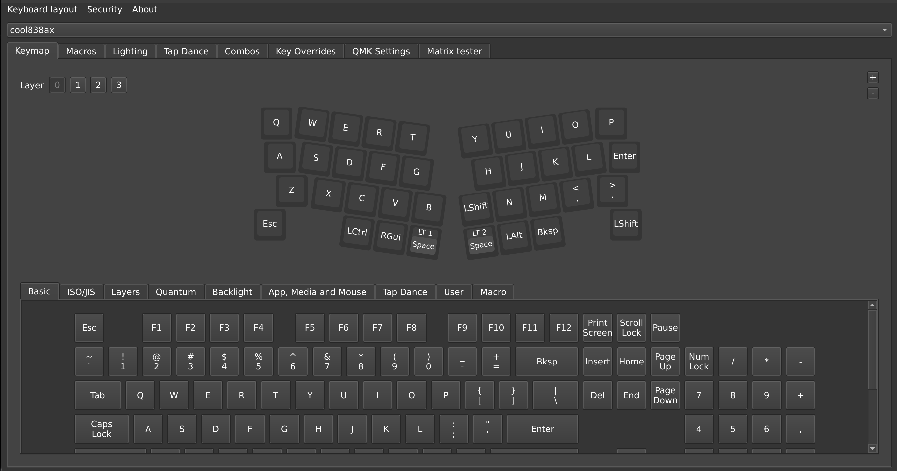

# ファームウェアについての覚書

m.ki設計の自作キーボードについて、MCUボードへファームウェアをインストールする手順について説明します。
 
ここでは、主にQMK_Firmwareについて説明します。
 

## pro microの場合

### 最初に
m.ki設計のpro micro使用の自作キーボードは、初期の作品になります。この頃の作品は、Remapによって、比較的に容易にキーマップ編集ができるので、Remapに登録されているものが多いです。
 

ここでいうRemapとは、[旧Remap](https://qmk018.remap-keys.app/)になります。一部、[新Remap](https://remap-keys.app/)に対応させたものもあります。しかし、新Remapに対応させると同時に、[vial](https://get.vial.today/)にも対応させていることが多くあります。
 
m.kの日常使う環境で、Remapが不安定な挙動をすることがあり、現在、Remapからの脱却を図っています。
 

### インストールの手順

QMK Toolboxを入手し、PCにインストールしてください。
https://github.com/qmk/qmk_toolbox

 
次にm.ki設計の自作キーボードhexファイルを、関係するgithubのfirmwareの中から見つけて下さい。見つけたら、自分のPC上にダウンロードしておいて下さい。

https://github.com/telzo2000

 
PCとpro microをUSBケーブルで繋いで下さい。
 
QMK Toolboxを立ち上げて下さい。

①「Open」クリックして、ダウンロードしていたhexファイル（画面では、cool664のvial用hexファイルが選択されています）を選択してください。
 
②「Auto-Flash」のチェックボックスを入れてください。
 
③MCUが「atmega32u4」になっているか確認してください。
 
 
自作キーボードのリセットスイッチを２回押す、または、pro microのリセットピンをショートさせることしてください。書き込みが始まります。
 
書き込みが成功すれば、QMK_firmwareがインストールされました。
 

## RP2040系MCUボードの場合

### 最初に

2021年秋頃より、m.kiはRaspberry pi picoやRP2040-ZeroのRP2040系MCUボードを使用したcool836pico、cool836rp 、cool640を設計しました。当初は、QMK_firmwareに対応していなかった為、PRK_firmwareでファームウェアを作成しました。その後、RP2040がQMK_firmwareに対応してから設計した自作キーボードはQMK_firmwareでファームウェアを作成しています。
 

### インストールの手順

m.ki設計の自作キーボードuf2ファイルを、関係するgithubのfirmwareの中から見つけて下さい。見つけたら、自分のPC上にダウンロードしておいて下さい。

https://github.com/telzo2000

PCとRP2040系MCUボード（以下、RP2040）をUSBケーブルで繋ぎます。
 
RP2040のbootボタンを押しながら、resetボタンを押すと、RP2040のフォルダがPC上にマウントされます。
 
先ほどのuf2ファイルをドラッグ&ドロップで、RP2040のフォルダ内に入れます。インストール終了です。
 

## キーマップ編集について

### 最初に

QMK_firmwareは2022年秋に0.19にバージョンアップする際、破壊的変更をしました。0.18以前と0.19以降で大きくキーコードが変わりました。Remapは2023年春に0.19以降のキーコードの破壊的変更に対応することを表明し、2023年秋に新Remapとして対応しています。m.kiは2023年夏に購入者から「Tap danceの機能が使いたいので、vial用のファームウェアが欲しい」と言われたので、vialについて学習して、その後のRP2040採用の自作キーボードはvial対応とした。

 

### Remap

0.18以前のQMK_firmwareで作成されたものは、旧Remapにてキーマップ編集ができます。Remapに自作キーボードを登録している設計者には、0.19以降の新Remapへの対応を求められました。m.kiにおいては、発表当時に合わせたファームウェアを本人以外の都合で更新することへの利点が少ない為（動作については問題なく、旧Remapを使用すればキーマップ編集も可能）、積極的な更新はしていません。 
それ故、m.ki設計の2023年夏以前の自作キーボードについては、旧Remapにてキーマップの編集をして下さい。購入者からの要望があれば、新Remapへの対応を考えますが、やれない場合が多いと思いください。

#### 使い方

PCと自作キーボードをUSBケーブルで繋ぎます。
 
PC上ではgoogle chromeで[旧Remap](https://qmk018.remap-keys.app/)にアクセスしてください。
 

（参考画像：cool838axを繋いだ時の様子）

 
あとは自由にキーマップの編集をしてください。

### vial

0.19以降のQMK_firmwareでファームウェアを作成したm.ki設計の自作キーボードはほぼ全て[vial](https://get.vial.today/)対応としています。
 
現在vialを強く進めているのは、従来のRemapと同じようにweb上でキーマップの編集ができること、またローカル版では自分のPC事情にキーマップのデータを残しておけることが、新Remapより長所と感じたためです。また、新Remapでは、利用者が色々と設定を変更できるようにした結果、その準備をする設計者の負担が増えていると感じています。ユーザーにとって利便性が増す結ことで、設計者はRemapを忌避する結果になったと思います。自分のローカル上でキーマップを編集したり、QMK configuraterでキーマップを編集したりするしかなかった時代に、web上でキーマップの編集ができるRemapは救世主でした。現在、web上でキーマップ編集できるツールは多くあり、m.kiとしては、それらの中で設計者にとっても、ユーザーにとっても、利便性が高いvialを使用していきます。

#### 使い方

PCと自作キーボードをUSBケーブルで繋ぎます。
 
PC上ではgoogle chromeで[vial](https://get.vial.today/)にアクセスしてください。
 

（参考画像：cool838axを繋いだ時の様子）

 
あとは自由にキーマップの編集をしてください。

