# 初心者の自作キーボードの作り方をします。
 
キーボード #2 Advent Calendar 2020 - Adventar 15日目の記事です。
 
昨日はyfukuさんの「bat43の何か」でした。
 
明日はackylaさんの予定です。
 

非IT系の仕事をしてます。自作キーボードに興味をもって、自分でも作ってみようと思い、いざ作り始めました。 
その際、利用した方法は、多分初心者で作ってみたい人に、役に立つかなと思い、ここにエントリーしました。 
ここに書いた内容は、インターネットや本で知りえた先達の知恵を自分なりに集成したものです。 
この通りやれば、私でも自作キーボードの一つ作れてしまいます。 
 

## １　デザインをする。 

自分が作りたいキーボードの構想をします。いろいろなやり方があると思います。実際にキーキャップを並べてみて、運指を確認するのも一つの方法です。私は、すぐにKeyboard-layout-editorで作り始めます。 
http://www.keyboard-layout-editor.com/
 
今回は、分割型キーボードをデザインします。分割型キーボードは未だ、自作したことがありません。多分、ファームウェアのところで、失速するかもしれません。そこまでは、何とかなると思います。 
 
構想したキーボード 
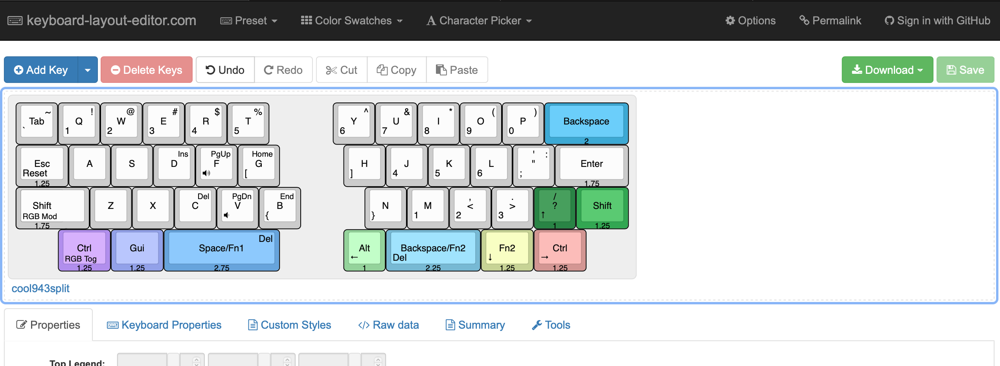
keyboard-layout-editorの使い方については、このサイトを参考にしました。他にもあったと思いますが、とりあえず。 
https://hagane-ya.net/archives/5018
 
 
構想したキーボードが出来上がりましたら、次に、画面の右上にある「DOWNLOAD」をクリックします。
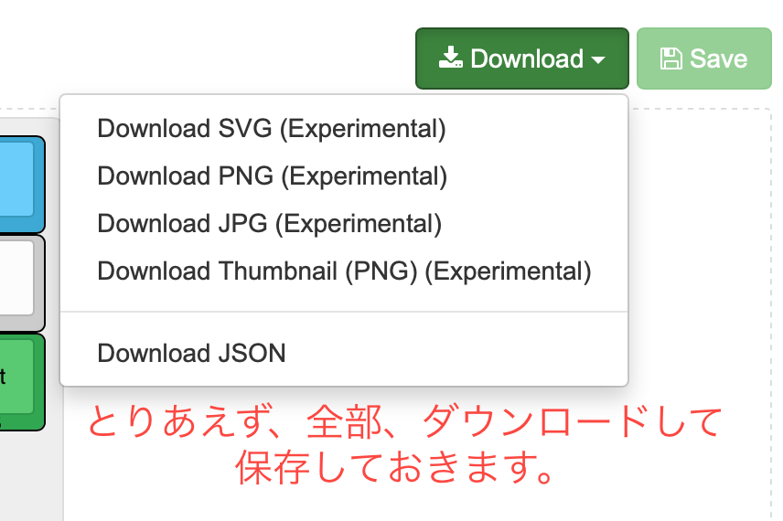
全部ダウンロードしておきましょう。どこかで使えるかもしれません。この後、一番使うものは、JSONファイルです。その次に、画面のように「Raw data」のタブを押して、Rawデータを全てコピーしてください。 
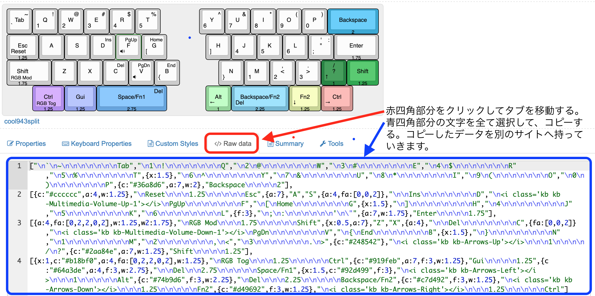
 

## ２　スイッチプレートのデータを作る。

 
（閑話休題）私はマックユーザーです。ここまでの作業は大体、Safariを使ってやります。次の作業からは私の環境下のSafariではうまくいかないため、Google Chromeで作業します。 
 
１で作りクリップ上にコピーされているRawデータを、Plate & Case Builderというサイトにペーストします。 
 

http://builder.swillkb.com/
 

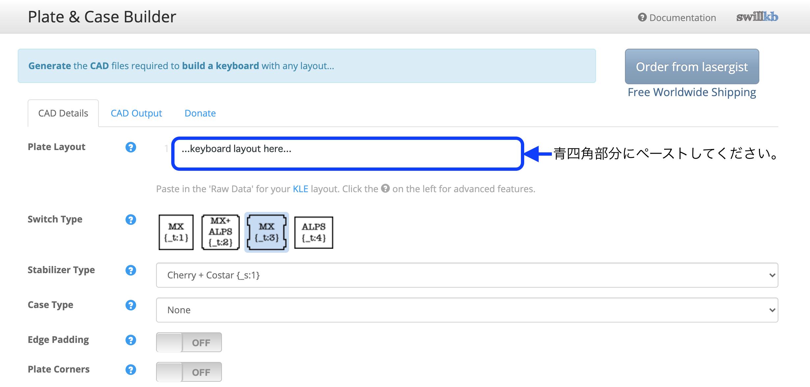

 
その後「Draw My CAD!」をクリックしてください。 

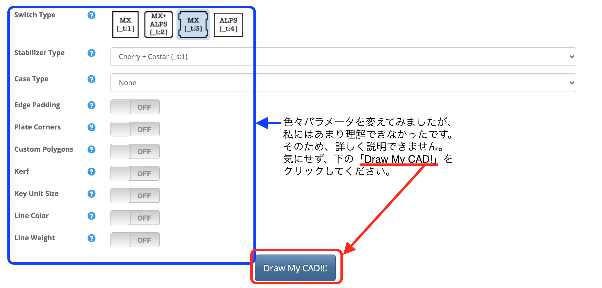

次の画面に変わります。 

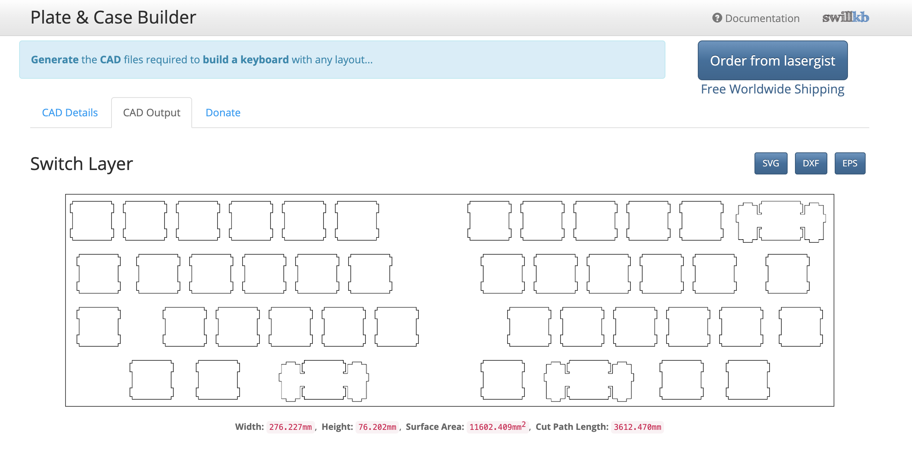

データの保存をします。保存できる形式は、SVG,DXF,EPSの３種類です。並んでいる順番で、一番左のSVGからクリックしがちですが、SVGは最後にしてください。
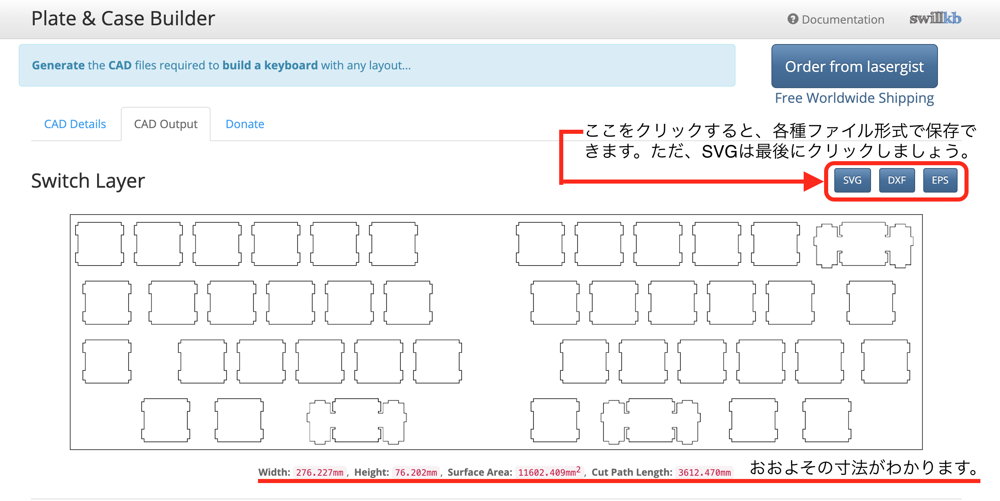
私はEPSをInkscapeでケース等の作成をするときに、DXFをCNCで加工するときに、利用します。私の作り方ではSVGを使用しないことがありますが、今後のために、いつも３種類保存します。 
SVGを保存するときは、右クリックをして、「リンク先を別名で保存」を選んで保存します。
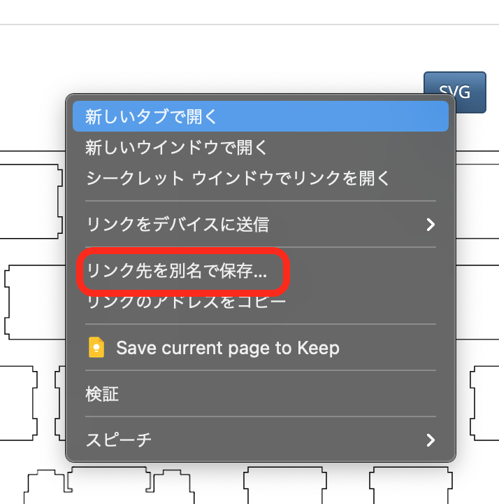

これをしないで、SVG保存を左クリックで選ぶと、次の画面になります。 

ここまでが、自分でデザインしたキーボードを、加工するための準備です。 
 
実は後でわかったのですが、ここで自分の構想したキーボードのミスをしていました。左手側(奥から順に)三行目左１番目のキースイッチの穴が間違っていました。 
まあ、実物で修正することとなりました。 
 

## ３　スイッチプレートの印刷をする

ここでは、EPSファイルをInkscapeを使って、A４用紙に印刷します。作ったキーボードが大きい場合、A４用紙に収まらないかもしれません。その場合、分割して印刷するとか、A３用紙が印刷できるプリントを使うなどの選択肢があります。私はA３用紙に印刷できるブラザーのプリンタを使っているので、分割して印刷したことがありません。ここで重要なことは、100%の大きさ（実際のサイズ）で印刷することです。 
 
Inkscape  
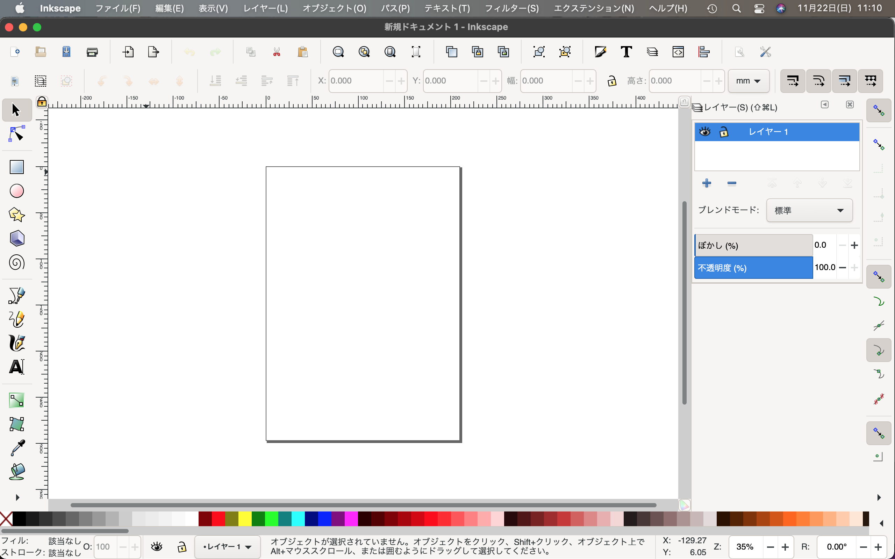
 
 
「ファイル＞ドキュメントのプロパティ」と選んでください。
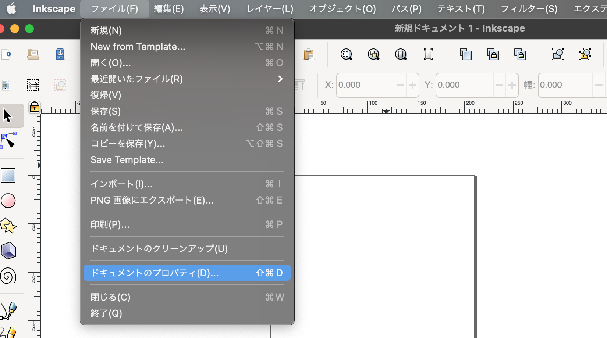
 
 
ここで、用紙のサイズをA4に設定してください。縦か横については、任意です。実際、横の方が良いと思いますが、後でする作業では大した差はありません。
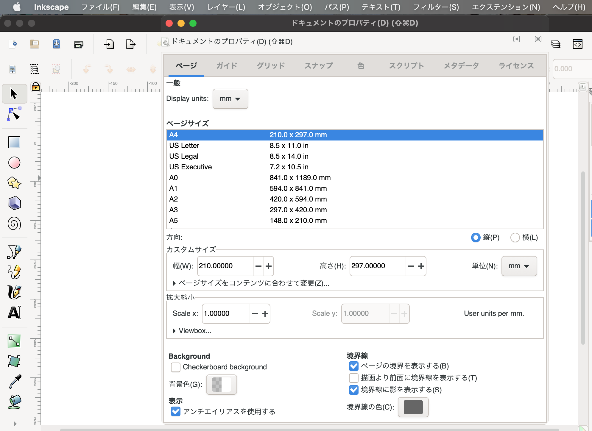

次に「ファイル＞インポート」を選んで、EPSファイルの取り込みをします。
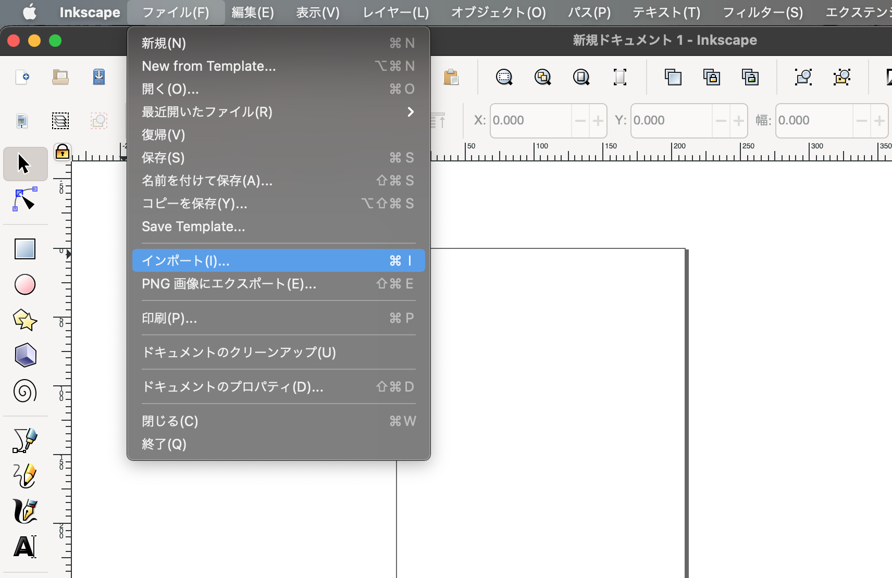

EPSファイルの保存場所を選択して、「Open」をクリックしてください。
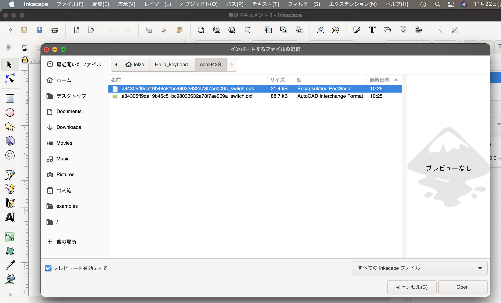

Inkscape画面上に、Plate&Case Builderで作成したスイッチプレートが表示されました。用紙の向きが「縦」のため、A4用紙内に治っていませんので、この後修正します。
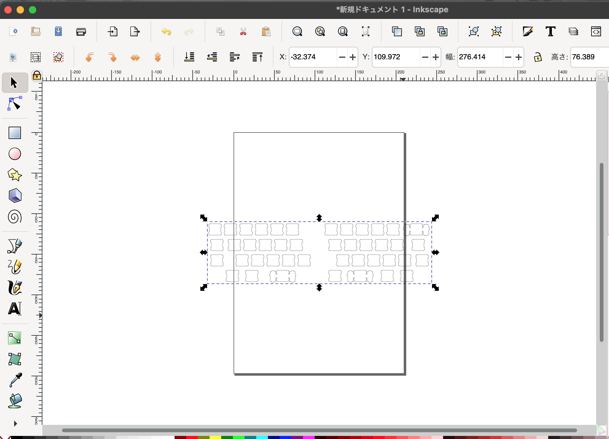
時計回りに回転のボタンをクリックします。この手間を避けるためには、用紙の設定したとき、向きを「横」にしてください。
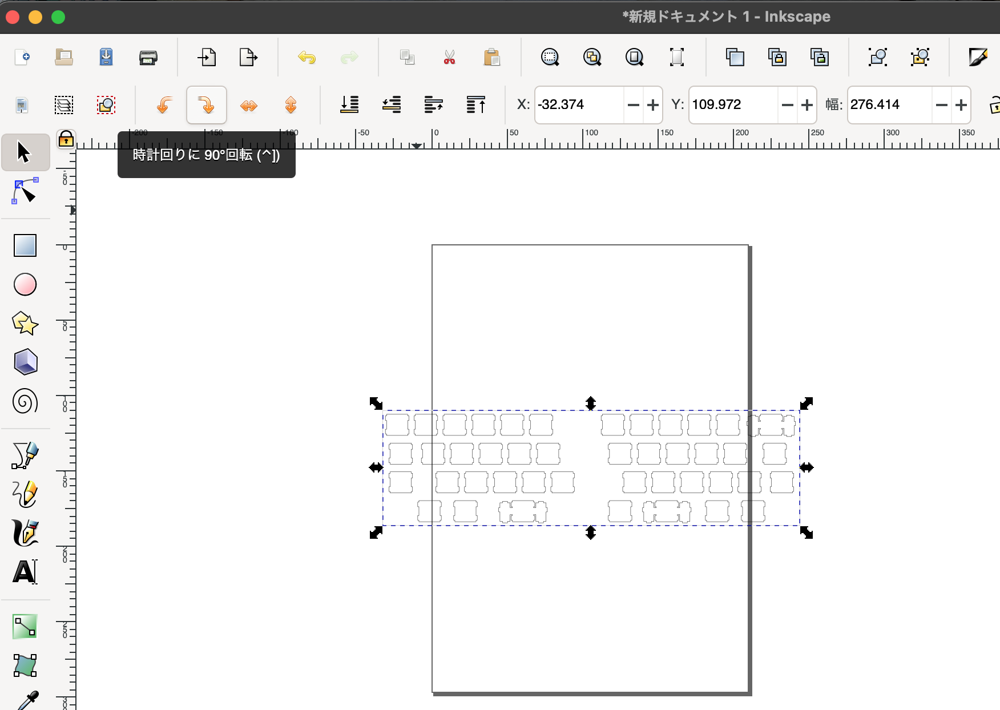
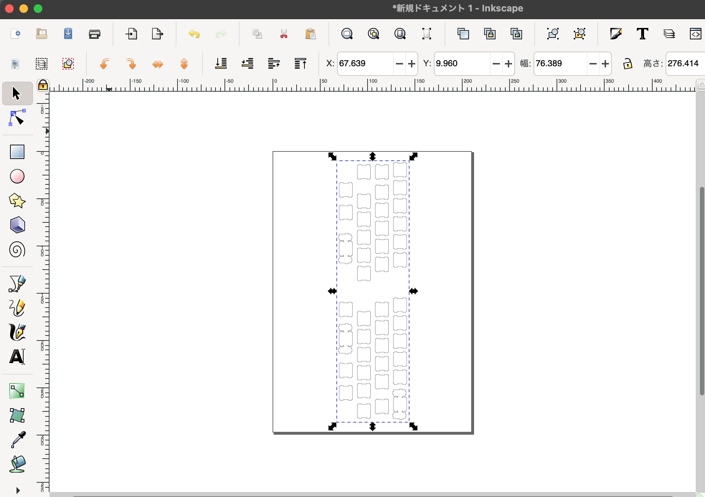

その後、印刷します。
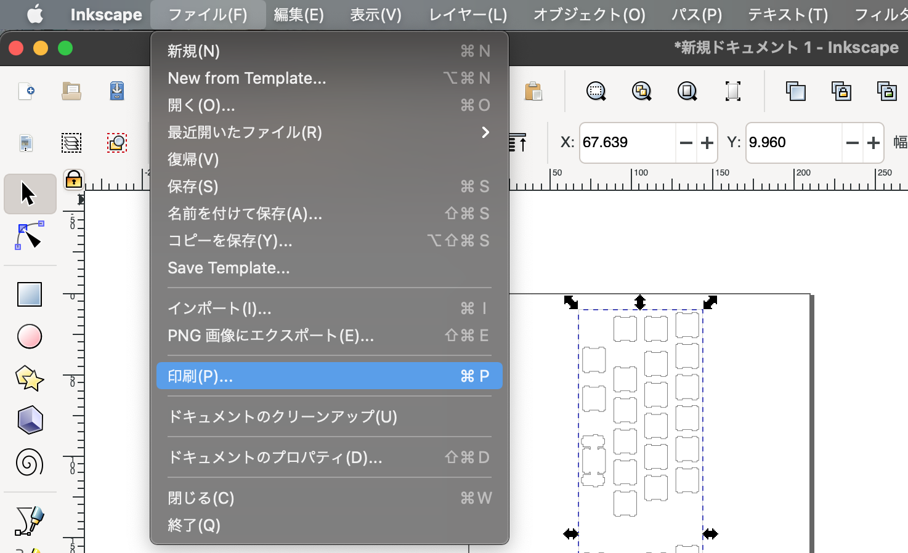
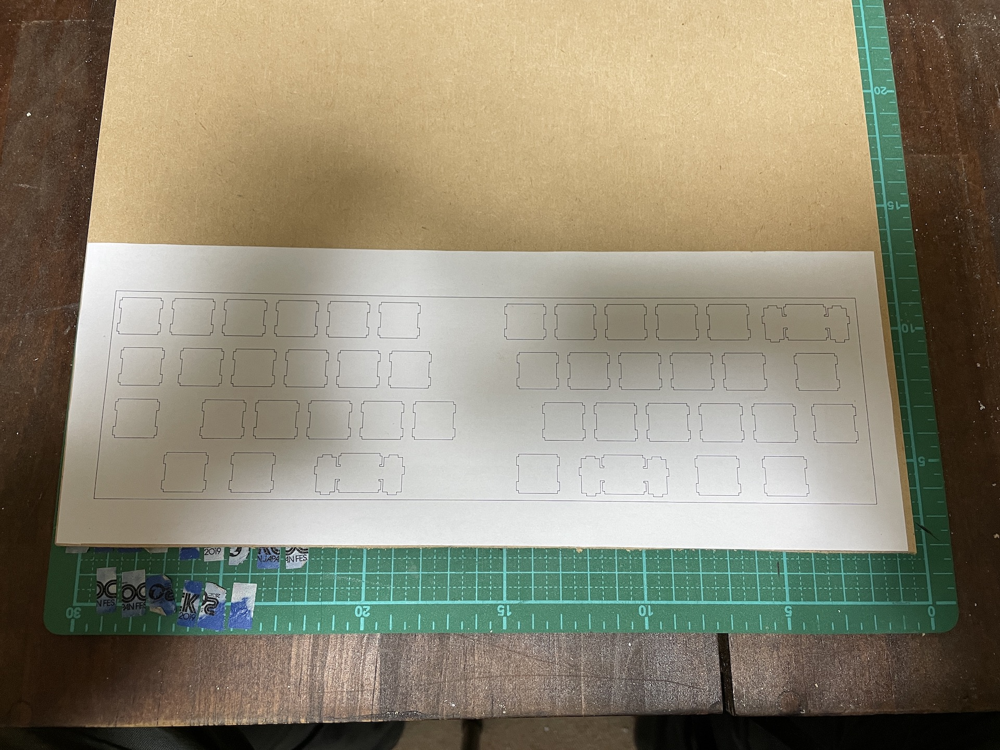

この後は、印刷されたものをスイッチプレートの材料となるものに貼り付けて、カッター、ハサミ、のこぎり、電動糸鋸等で裁断します。 
今回は、私は使い勝手の良いMDF材に糊で貼り付けます。強力な糊でなければ、後で剥がせると思います。 
これは最初、分割型キーボードと書きました。これを加工する際、分割していく予定です。 
Inkscapeのファイルを元に、遊舎工房等アクリル加工を引き受けてくれるお店に発注する方法もあります。そちらについては割愛します。 
 

## ４　スイッチプレートを加工する。

ここでは、スイッチを挿し込むスイッチプレート（トッププレートとも）の加工作業を説明します。 
どこの家庭にも一つはあると思う、電動ドリルと電動糸鋸を使うと作業は比較的早く終わります。 
※当然、錐と糸鋸でも作業はできます。ただ、時間が多くかかりますので、あまりお勧めはしません。 
最初に電動糸鋸の鋸刃（鋸歯？）を通すために、電動ドリルで穴をあけます。穴の大きさは、２ｍｍのドリルビットで開けてから、さらに４ｍｍのドリルビットを使い拡張します。 
MDF材に印刷したキーレイアウトを貼り付けたもの 
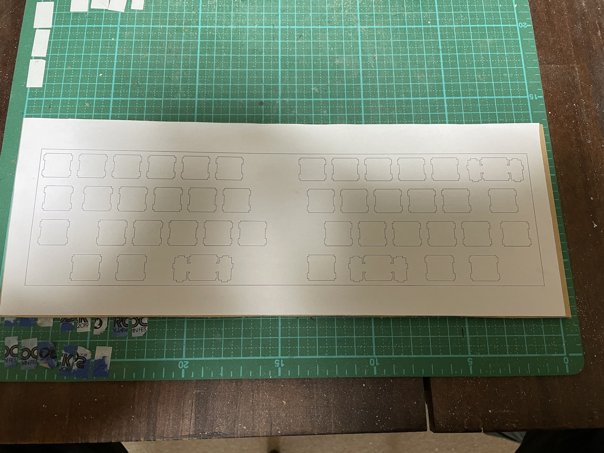
 
キースイッチを一つ一つ、鋸で切り抜いていきます。最初に、電動ドリルを使って、鋸の歯を通す穴をあけます。 

その後、電動糸鋸で裁断していきます。 

※ドリル穴を２か所開けるのは、電動糸鋸で裁断中に、鋸の向きを変える場所が必要だからです。穴１か所でも、作業はできます。  

空いた穴に、キースイッチを挿し込みます。挿し込みがきついときは、やすり等で周囲を削って拡張します。 

この作業を全てのキースイッチ部分で行います。ちょっと時間がかかる作業ですので、疲れたら休むことがよい成果を生むと思います。 
はじめて、この作業をしたときは、30数個開けるのに、４～５時間かかりました。材質がアクリルだったことも時間がかかった理由です。 

全ての穴が開いたら、それぞれにキースイッチを挿し込んでいきます。 

