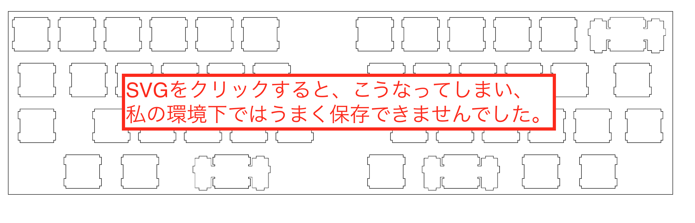
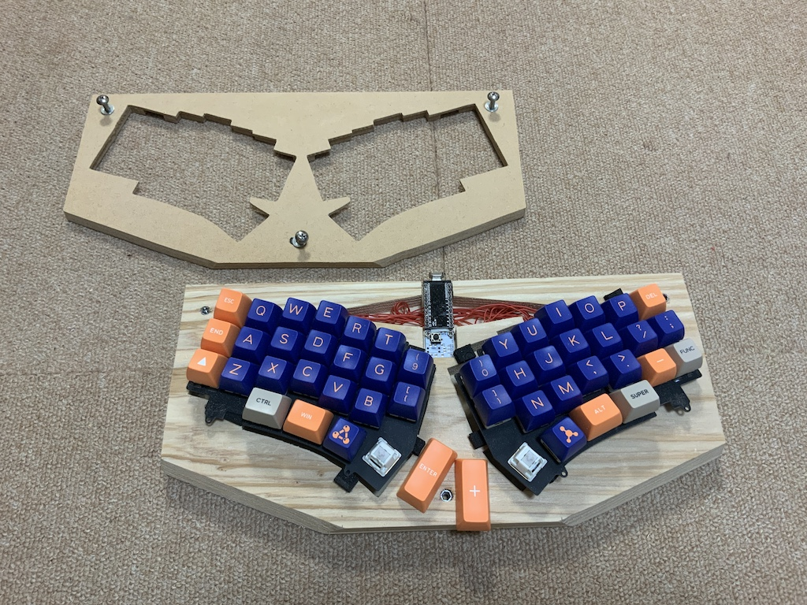

# 初心者の自作キーボードの作り方をします。
 
キーボード #2 Advent Calendar 2020 - Adventar 15日目の記事です。
 
昨日はyfukuさんの「bat43の何か」でした。
 
明日はackylaさんの予定です。
 

非IT系の仕事をしてます。自作キーボードに興味をもって、自分でも作ってみようと思い、いざ作り始めました。 
その際、利用した方法は、多分初心者で作ってみたい人に、役に立つかなと思い、ここにエントリーしました。 
ここに書いた内容は、インターネットや本で知りえた先達の知恵を自分なりに集成したものです。 
この通りやれば、私でも自作キーボードの一つ作れてしまいます。 
 
 

# １　デザインをする。 

自分が作りたいキーボードの構想をします。いろいろなやり方があると思います。実際にキーキャップを並べてみて、運指を確認するのも一つの方法です。私は、すぐにKeyboard-layout-editorで作り始めます。 
http://www.keyboard-layout-editor.com/
 
今回は、分割型キーボードをデザインします。分割型キーボードは未だ、自作したことがありません。多分、ファームウェアのところで、失速するかもしれません。そこまでは、何とかなると思います。 
 
構想したキーボード 

keyboard-layout-editorの使い方については、このサイトを参考にしました。他にもあったと思いますが、とりあえず。 
https://hagane-ya.net/archives/5018
 
 
構想したキーボードが出来上がりましたら、次に、画面の右上にある「DOWNLOAD」をクリックします。

全部ダウンロードしておきましょう。どこかで使えるかもしれません。この後、一番使うものは、JSONファイルです。その次に、画面のように「Raw data」のタブを押して、Rawデータを全てコピーしてください。 

 
 

# ２　スイッチプレートのデータを作る。

 
（閑話休題）私はマックユーザーです。ここまでの作業は大体、Safariを使ってやります。次の作業からは私の環境下のSafariではうまくいかないため、Google Chromeで作業します。 
 
１で作りクリップ上にコピーされているRawデータを、Plate & Case Builderというサイトにペーストします。 
 

http://builder.swillkb.com/
 

 
その後「Draw My CAD!」をクリックしてください。 

次の画面に変わります。 

データの保存をします。保存できる形式は、SVG,DXF,EPSの３種類です。並んでいる順番で、一番左のSVGからクリックしがちですが、SVGは最後にしてください。

私はEPSをInkscapeでケース等の作成をするときに、DXFをCNCで加工するときに、利用します。私の作り方ではSVGを使用しないことがありますが、今後のために、いつも３種類保存します。 
SVGを保存するときは、右クリックをして、「リンク先を別名で保存」を選んで保存します。

これをしないで、SVG保存を左クリックで選ぶと、次の画面になります。 

ここまでが、自分でデザインしたキーボードを、加工するための準備です。 
 
実は後でわかったのですが、ここで自分の構想したキーボードのミスをしていました。左手側(奥から順に)三行目左１番目のキースイッチの穴が間違っていました。 
まあ、実物で修正することとなりました。 
 

# ３　スイッチプレートの印刷をする

ここでは、EPSファイルをInkscapeを使って、A４用紙に印刷します。作ったキーボードが大きい場合、A４用紙に収まらないかもしれません。その場合、分割して印刷するとか、A３用紙が印刷できるプリントを使うなどの選択肢があります。私はA３用紙に印刷できるブラザーのプリンタを使っているので、分割して印刷したことがありません。ここで重要なことは、100%の大きさ（実際のサイズ）で印刷することです。 
 
Inkscape  

 
 
「ファイル＞ドキュメントのプロパティ」と選んでください。

 
 
ここで、用紙のサイズをA4に設定してください。縦か横については、任意です。実際、横の方が良いと思いますが、後でする作業では大した差はありません。

次に「ファイル＞インポート」を選んで、EPSファイルの取り込みをします。

EPSファイルの保存場所を選択して、「Open」をクリックしてください。

Inkscape画面上に、Plate&Case Builderで作成したスイッチプレートが表示されました。用紙の向きが「縦」のため、A4用紙内に治っていませんので、この後修正します。

時計回りに回転のボタンをクリックします。この手間を避けるためには、用紙の設定したとき、向きを「横」にしてください。

その後、印刷します。

この後は、印刷されたものをスイッチプレートの材料となるものに貼り付けて、カッター、ハサミ、のこぎり、電動糸鋸等で裁断します。 
今回は、私は使い勝手の良いMDF材に糊で貼り付けます。強力な糊でなければ、後で剥がせると思います。 
これは最初、分割型キーボードと書きました。これを加工する際、分割していく予定です。 
Inkscapeのファイルを元に、遊舎工房等アクリル加工を引き受けてくれるお店に発注する方法もあります。そちらについては割愛します。 
 

# ４　スイッチプレートを加工する。

ここでは、スイッチを挿し込むスイッチプレート（トッププレートとも）の加工作業を説明します。 
どこの家庭にも一つはあると思う、電動ドリルと電動糸鋸を使うと作業は比較的早く終わります。 
※当然、錐と糸鋸でも作業はできます。ただ、時間が多くかかりますので、あまりお勧めはしません。 
最初に電動糸鋸の鋸刃（鋸歯？）を通すために、電動ドリルで穴をあけます。穴の大きさは、２ｍｍのドリルビットで開けてから、さらに４ｍｍのドリルビットを使い拡張します。 
MDF材に印刷したキーレイアウトを貼り付けたもの 

 
キースイッチを一つ一つ、鋸で切り抜いていきます。最初に、電動ドリルを使って、鋸の歯を通す穴をあけます。 

その後、電動糸鋸で裁断していきます。 

※ドリル穴を２か所開けるのは、電動糸鋸で裁断中に、鋸の向きを変える場所が必要だからです。穴１か所でも、作業はできます。  

空いた穴に、キースイッチを挿し込みます。挿し込みがきついときは、やすり等で周囲を削って拡張します。 

この作業を全てのキースイッチ部分で行います。ちょっと時間がかかる作業ですので、疲れたら休むことがよい成果を生むと思います。 
はじめて、この作業をしたときは、30数個開けるのに、４～５時間かかりました。材質がアクリルだったことも時間がかかった理由です。 

全ての穴が開いたら、それぞれにキースイッチを挿し込んでいきます。 

全ての穴にキースイッチを挿し込んだら、この部分は終了です。 

次の段階では、いつでも便利なSU120を使って、キースイッチ一つ一つに取り付けて、配線処理を行います。 
 

# ５　SU120の取り付け
ここでは基板部分の製作になります。 
kicadについてよくわからない初心者の私にとって、SU120や無限の可能性は、救世主となります。 
ここではSU120での製作について書きます。詳細については、作者のHPが最適です。 
https://github.com/e3w2q/su120-keyboard
 
作者のHPを読んだ上で、ここを読み進めてください。 

今回は作者のHPにある、ガーバーファイルを発注して入手した黄色のPCBを使って作業をします。 
初めてのSU120であれば、例えばTALP KEYBOARDさんで販売されている、 
キットを購入した方が良いと思います。これに合わせて、MXソケットを必要分（私の場合は、43個必要なので、10個１セットを５セット）、pro microを必要分（私の場合は、分割するキーボードなので２個）購入することとなります。 
よくキットを購入して、嬉しくて届いたら、MXソケットやpro microがなくて、ちょっと残念な気持ちでもう一度注文することがないようにしましょう。 

### SU120 自作キーボード用基板（分割キーボードセット）
https://talpkeyboard.stores.jp/items/5e7ede422a9a4210748af1eb
### Kailh PCBソケット (MXスイッチ用/10Piece)
https://talpkeyboard.stores.jp/items/5e02c5405b120c792616bcf9
### Pro Micro ATmega32U4 5V/16MHz/MicroUSB2(互換品)
https://talpkeyboard.stores.jp/items/5b24504ba6e6ee7ec60063e3

理由は、初心者で何を用意すればわからない時ほど、このセットが便利だからです。 
下の二つに関しては、遊舎工房さんやKochi Keyboardさんでも取り扱っています。 
https://yushakobo.jp/
 
https://kochikeyboard.stores.jp/
 
 
これで必要なものに慣れてから、私のように直接PCBをelecrow等に発注することもしてもよいのかなと思います。 
 
さて、ここでの手順は、次の通りです。 
(1) 必要な形にSU120を切り分けて、配置する。 
(2) 一度外してSU120のバリの処理をする。 
(3) SU120にダイオード、MXソケット等をハンダ付けする。※１ 
(4) SU120を再び配置する。 
(5) 必要なところに、切り取り余ったダイオードの足で接合する。 
この作業の次というか、同時進行でケース作りもします。 
 
※１　pro microやリセットスイッチ、TRRSオーディオジャックのハンダ付けを一緒にする場合もあったり、後からする場合もあったりします。今回は、後からハンダ付けをしました。 
 
## (1) 必要な形にSU120を切り分けて、配置する。 
私の場合は、横ずれのキーレイアウト（ロウスタッガード）ですので、全てのパーツを切り離すのではなく、横一列（SU120を５つ）を一塊として使っています。SU120はパーツとパーツの連結部分に配線処理がされているので、切り離さなければ、塊ごとに導通できます。 

 
## (2) 一度外してSU120のバリの処理をする。 
地味なやすりがけです。写真はありません。室内でやると咽せるので、玄関の外でやることが多いです。100均で売っている金属製のやすりがあれば、作業できます。 
 
## (3) SU120にダイオード、MXソケット等をハンダ付けする。 
SU120の細かいハンダ付けについては、作者のHPを確認しながら行ってください。マスキングテープがあると、便利です。私の作業板には使い回しのマスキングテープが常に貼ってあります。何度も使いまわして粘着が弱くなったら、新しいマスキングテープに交換です。 
ダイオードの足を切り離した部分は、後で使いますので、捨てないでください。また、切り離し作業をすると、ダイオードの足が飛んでいってしまうことが多々あります。私は百均で買ったバケツの中で切り離し作業をします。バケツの底には切り離したダイオードの足が残ります。全ての作業が終わったあと、残ったダイオードの足はチャック付きプリ袋に入れて保管しています。 
 
## (4) SU120を再び配置する。 
バリが取れてきれいになったSU120を(1)と同じように配置します。たまに、配置した場所を忘れてしま、同じような配置ができないことがありますが、気にしないことです（多分）。 

 
## (5) 必要なところに、切り取り余ったダイオードの足で接合する。 
ここが重要かつ、大変な作業です。(3)の作業を行うと、切り取ったダイオードの足を余ります。捨てずに、ここで使います。ラジオペンチ等を使い、かすがいの形に折り曲げて、SU120のパーツ同士の連結に使います。 
明るい部屋と、ルーペがあると作業はしやすいと思います。焦ると、どこかにかすがいの形にしたダイオードの足が飛んで行きますが、気にせず、新しく折り曲げましょう。新しいものを作り終わった頃に出てきます。 

かすがいを付けたら、ハンダ付けです。強度を考えながら、かすがいを付けていってください。また、配線処理もするので、横方向で離れている、ROW同士もかすがいで、縦方向で離れているCOL同士もかすがいで、連結してハンダ付けをしてください。地味に疲れます。疲れたら、休んでください。1日で終えようと頑張ると、うまくいきません。気にせず、時間をかけて確実に仕上げてください。 

１箇所スイッチプレートの穴あけミスをした場所以外、連結をしたものです。 

 
 
# ６　ケース作り
ここではスイッチプレートを利用してキーボードを守るケースづくりをします。 
ケースについては、スイッチプレートとボトム方レートで挟み込むサンドイッチマウントが一番簡単に作れると思います。間に挟むスペーサーと呼ばれるナットの長いものも、最近ではKOCHI KEYBOARDさんで取り扱っていて、とても助かります。たくさん利用するならば、WILCOさんや海外からの通販という手段もあります。少量でよければ、KOCHI KEYBOARDさんが最適かなと思います。 
他に3Dプリンタで作る方法や、アクリル板を重ねて積層型のケースを作る方法もあります。 
3Dプリンタやアクリル加工の技術がないときは、私のようにMDF材やシナベニヤ材等の木工で作ることをお勧めします。近くのDIY店に行けば、MDF材やシナベニヤ材は厚さが２〜４mmで寸法300x450のものでも、１枚あたり300〜500円で買えます鋸があれば、誰でも簡単に裁断できます。木工ボンドで簡単に積層型ケースが作れるます。百均で売っている塗料で着色するだけでも十分にきれいなケースが作れます。 
これらは、私の作例です。 
MyFirstMini 
木材で箱を作りました。スイッチプレートはアクリル板を加工しています。スイッチプレートの固定には、木ネジを使っています。そのため、取り外しを重ねると、ネジ穴がダメになる可能性があります。 

 
Caravellion 
ちょっと厚めの端材を切り抜いて作りました。スイッチプレートはCaravelle BLEの余りのスイッチプレートを使っています。トッププレートをMDF材で加工しています。スイッチプレートの取り外しに関して、埋め込みナットを使用しています。ただ、自作キーボードで一般的に使用されるM2ネジのような細いネジが使えません。 

 
cool635 
スイッチプレートはプリプレペン板（だと思う、やわらかいプラスチック製の板）を加工しています。カッターで切断できるので簡単なと思ったけど、柔らかすぎて、逆に裁断しらかったです。 

cool753 
スイッチプレートを含めMDF材で加工しています。 

 
cool836A 

