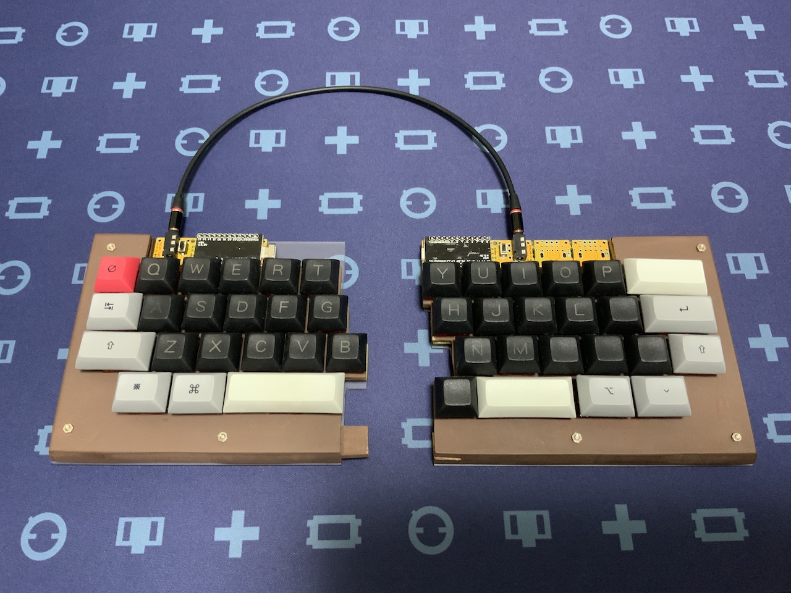

# 初心者の自作キーボードの作り方をします。<続き>
 
　キーボード #2 Advent Calendar 2020 - Adventar 15日目の記事の続きです。その後、どうなったかについて報告です。
 
　 

# ７　ファームウェア（１）

 
　15日の記事までに、完成を目論んでいました。しかし、ファームウェアの面で失速しました。
私はマックユーザーですが、それでプログラミングをするような技術はありません。せっせとネットの情報を読んで、
マックでQMK FIRMWAREを使える環境を作ろうとしました。結論を書くと、できませんでした。 
　その時、閃いたのだ、子供用に以前、用意したラズベリーパイならば、できるかもしれないと思い、
こちらもネットで情報収集をすると、実践例がありました。マックの環境をまっさらにするのは、
仕事上、困ることもあるのでできません。 
　でも、今や我が家で誰も使わないラズパイであれば、うまくいかなければ、真っ新にして環境を作り直せばいいやと考えて、
ラズパイでの環境構築をしました。Windowsはないのかという声に対しては、実はあります。
でも使っていません。マックですら、できなかった私にはWindowsで、できるはずもなく、挑戦しましたが、
すぐに撤退しました。 
　ラズパイでのQMK FIRMWAREについては、エラーメッセージが出るたびに、
それをコピーして、調べました。そのうち、何となく解決するには、エラーメッセージ近くに解決するコマンドがあることがわかりました。
そのコマンドを入れると、そのうち、エラーメッセージが出なくなりました。
もし、QMK FIRMWAREがうまくできない人は、ラズパイを使うと、追加投資少なめで何とかなるとかもしれません。
ならない時は諦めてください。 
　分割キーボードを自作しようと思わなければ、ファームウェアを作るのは、KEYBOARD  FIRMWARE BUILDERというサイトがあります。
私は、今回の分割キーボード以前の作品は、全て、このサイトでファームウェアを作っています。使い方がわかると、大変便利です。
最近、LEDを実装したキーボードのファームウェアも作れるようになったので、本当に初心者には重宝します。 
 
　今回、私はラズパイでQMK FIRMWAREが使えるようになったので、そこでファームウェア（Hexファイル）を作成しました（ビルドしましたが正しい表現ですかね）。
そのファームウェアを作る段階で、SU120の配線処理に、課題があることがわかりました。課題とは次のことです。 
　①右側と左側とで、使っているピンが違う。 
　②左側のキーボードは、pro microの位置が左に寄りすぎており、USBケーブルを挿すことができない。 
　課題①については、ファームウェアを何とかすれば解決するかと思い、色々とピンの表記や順番を変えてみました。思ったような効果が出ませんでした。
実際、それによりキーを打鍵しても、入力されない状況が続きました。 
　課題②については、解決について２つの方法を考えました。方法１は、ケースの一部を削ってケーブルを挿しやすくすること。
方法２は、pro microの載っているSU120を一度切り離して、表裏反転させて、ケーブルの端子を内側に向けること。
結果として、課題①②を同時に解決できるとして、方法２を選択しました。SU120を切り離して、併せて配線処理をやり直して、
左右同じピンを使用するよう修正しました。加えて、ロータリーエンクロージャーを取り付けるSU120を２つ分取り除きました。
追加の修正により、左側のpro microの端子は内側を向きます。そこにケーブルを挿しても、右側のキーボードを干渉することがなくなりました。
合体して使用する際、ケーブルの取り回しが課題でした。今回は試作品だったので、目を瞑って、将来作るかもしれないcool943S完成品で改善するつもりでした。
しかし、結果的に、pro microの設置位置の見直しや配線の修正によって、良い方向へ進むことができました。試行錯誤するのも良いと思います。 
 
修正前の写真　※左側のpro microの位置が左に寄っているため、ケースに干渉して、ケーブルを挿入できない。 

  

 

 

修正後の写真　※左側のpro microをおくSU120を裏返して、端子の挿入口が内側を向くように修正。 

 

 
 

# ファームウェア（２）
 
　前述の文章では、私のような初心者には全くラズパイでのQMK_FIRMWAREで環境を構築する方法がわからないと思うので、実際の手順を記します。
これは、数日後、改めて、最初からラズパイにQMK_FRIMWAREを導入したとき、行った流れです。 
 

#### １　ラズパイのOSを入手。

①入門本にも載っているように、ラズベリーパイのOSを配布するサイトへアクセスする。 
②マックにRaspberry Pi Imagerというアプリを入れて、そこからラズパイ用に購入したマイクロSDカードにOSを入れる。 
③マイクロSDカードを私が持っているラズパイ3B+に挿入して電源を入れる。 

#### 2　ラズパイの初期設定をする。

　入門本の通り、最低限のことをする。この時点で、MZOCやVimを入れておく。ただ、私は非IT系なのでVimはよくわかりませんでした。ラズパイに標準でついているText Editorで処理しています。 

#### 3　QMK_FIRMWAREを入手する。

①LXTerminalを起動する。次の言葉を入力する。 
git clone https://github.com/qmk/qmk_firmware  
しばらく時間がかかるけど、問題なくラズパイにダウンロードされます。 
②場所の確認をする。次の言葉を入力する。 
ls  
このあと、Desktop、Documentなどの表示の中に、qmk_firmwareがあれば、①の作業は成功しています。 
③場所を移動して、次の言葉を入力する。 
cd qmk_firmware  
さらに、 
make git-submodule  
ちょっと時間かかると思いますが、待っていてください。これが終わったら、 
util/qmk_install.sh  
を入力してください。 
ここまで行うと、基本、終了です。途中でエラーメッセージが出ると、あせります。それでも、関係なく、qmk_firmwareがビルドできるようです。その確認をするために、適当なキーボードでHexファイルをビルドしてみます。 
make nomu30/rev1:default  
私はnomu30を持っているので、これでやりました。詳しく説明すると、 
make nomu30:default　 
ではエラーメッセージが出ると思います。nomu30は、令和2年9月にリミテッドエディションが発表された際、それまでのものをrev1、リミテッドエディションになったものをrev2と分けられています。 
qmk_firmware内のkeyboardsフォルダ内で、nomu30フォルダを探すと、その中にはrev1、rev2とフォルダがあります。今回試しにビルドしたのは、rev1です。
その場合、nomu30/rev1とします。これがうまくビルドできれば、先程までのエラーメッセージは、ビルドをする環境について問題ないと思います。私もエラーメッセージが出ましたが、問題ありませんでした。 
 
ここからは、下記の参考にしたサイトを乗っ取って、分割キーボードの設定をつくりました。前述の課題①（右側と左側とで、使っているピンが違う。）については、
左側のpro microの乗るSU120を表裏、帰る際、配線処理をし直しました。下の写真のように、左右のピン（COL、ROW）を共通にしました。 

## 参考にしたサイト

ラズパイでのQMK環境構築について
https://babe-mt.hatenablog.com/entry/2018/02/27/094353

https://stupiddog.jp/note/archives/1599

http://ne-zu-ppo.blogspot.com/2020/

SU120でQMK FIRMWAREの作成について
https://k-kuro.hatenadiary.jp/entry/20200927/1601192264

# まとめ
 
　ここまで来るのに、作り始めてから、およそ１ヶ月半かかっています。毎日、悩んでいたわけではないけど、良い方に解決すると、
その悩んでいた時間が良かったと思います。表裏反転させたpro micro部分のSU120の固定は、SU120のパーツをM1.4のネジとナットで固定しています。
ダイオードのあまり足を使って、かすがいを作って固定しても良いと思います。ただダイオードの足よりは強度があるかと思います。
左側のキーボードは、ケースに装着して、完成です。ファームウェアで自分好みのキーレイアウトを作り上げれば、エンドゲームにまた、一歩近づくと思います。
 
 

今回の続きの記事は、この記事で制作過程を紹介したSU120で作った40％分割の自作キーボードcool943Sで書きました。もし、Cocoa40が今でも頒布されていたら、このキーボードを作ろうと思うことはなかったと思います。欲しいものを熱望することは、創作の意欲を掻き立てるのかなと思います。魅力ある自作キーボードやカスタムキーボードを見ることは、本当に楽しいですね。
