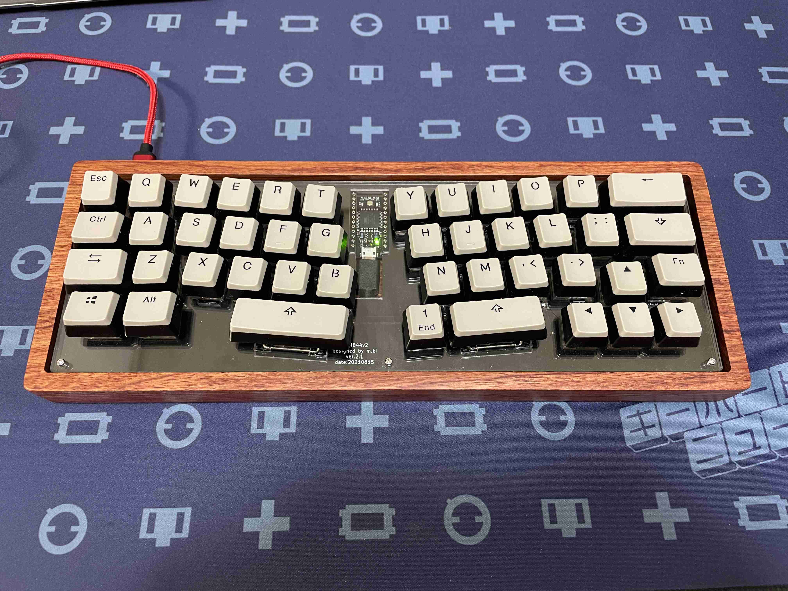
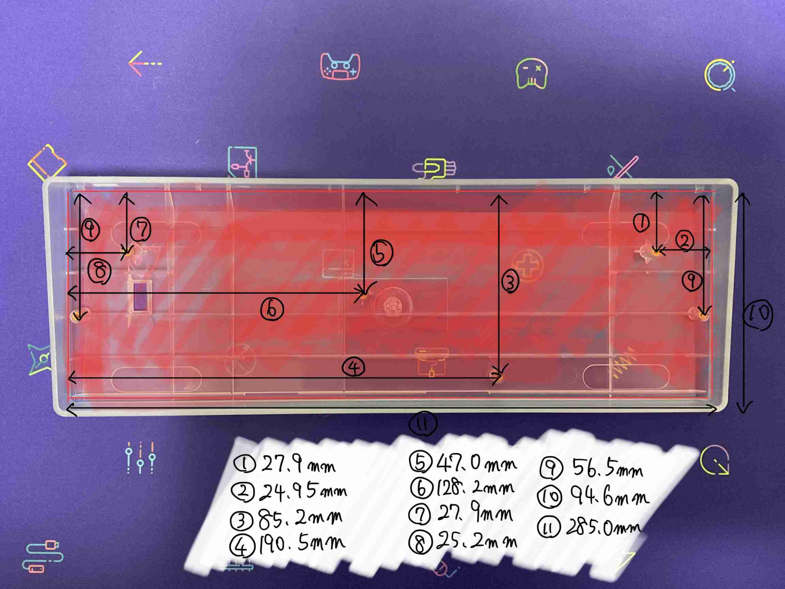

# poker互換の60％汎用キーボードケースを使用する自作キーボードに関する一考察 -coo844における活用方法-

　キーボード #2 Advent Calendar 2021 - Adventar 25日目の記事です。 
https://adventar.org/calendars/6280
 
　クリスマスイブの24日目はあんりあるさんの「ディスプレイをモジュール化してキーボードを作るぞ（nowpad）」でした。 
https://qiita.com/unreal5050/items/ae9a4b11164f94538778

 
　nowpadはかわいいですね。
仕事机にあったら、注目の的ですね。
 
　今回のテーマのタイトルは「poker互換の60％汎用キーボードケースを使用する自作キーボードに関する一考察-cool844における活用法-」と長くて堅苦しいものです。 
60％汎用ケースを使った、自作キーボードcool844の話です。
ポエムになっていたら、すみませんが、お付き合いください。
 
 

## 1.経緯
 　昨年のアドベントカレンダーでは、いつでも便利なSU120を使って、40%の分割キーボード[cool943Sの作り方](https://github.com/telzo2000/Hello_keyboard/blob/main/selfmademykeyboard.md)を書きました。    

 
　今年初めに、以前作った[cool836A](https://github.com/telzo2000/cool836A)のラージ版として考えた自作キーボードをpoker互換の60％汎用ケース（以下、汎用ケース）に収めることを思い付き、実行しました。
 
　それが、cool844（[詳細](https://github.com/telzo2000/cool844)）になります。

 
　cool844ver.1.0では、汎用ケース収める際、6箇所あるネジ固定のうち、アリス配列に模したキーレイアウト上、キーと干渉した1か所がきちんと対応できず、打鍵すると、その部分がやや沈む欠点がありました。
 
　その後、ver.1.1をリリースして、先ほどの欠点を克服しました。
それは、リーフを名付けたパーツを装着して、ネジで固定する箇所をずらす工夫することで、汎用ケースにうまく収めることができました。
 
ただし、汎用ケースは製品ごとに形状にわずかながら違いがあります。
そのため、cool844が収まらず、汎用ケースの一部を改造をすることもありました。
 
例えば、プラスチックケースに収まるけど、木製ケースでは干渉する部分があり、木製ケースの一部を削ることが必要となりました。
 

このユーザーからのフィードバックを元に、汎用ケースに問題なく収めるために、どうすればいいか考え始めて、cool844ver.2.0を経て、ゲタと呼ぶ方法で、汎用ケースに収めるcool844ver.2.1であるcool844V2（[詳細](https://github.com/telzo2000/cool844V2)）が完成します。

 
　今回の記事では、そこに至るまでの試行錯誤をお話しし、誰でも、poker互換の60%汎用ケースで自作する方法の一端をまとめます。
 
 

## 2.汎用ケースの種類や寸法
 
　ここで話す「汎用ケース」とは、poker・GH60互換のトレイ系と分類されるものを指します。
国内のTALP KEYBOARDや遊舎工房、海外のKBDFans等で取り扱われている、
一例を挙げると、

[DZ60REV3.0](https://shop.yushakobo.jp/collections/pcb/products/dz60)等が収納できる60%キーボードケースと書けば、わかりやすいでしょうか。
このような汎用ケースがどれくらい、種類があるか、把握していません。
 
　私は、cool844の設計時にはプラスチック製のケース（[これ](https://talpkeyboard.net/items/615ff2c3784e3f4bd872a731)や[あれ](https://shop.yushakobo.jp/collections/case/products/60-plastic-case)）を購入して以来、
少しずつ買い足して、[木製のケース](https://shop.yushakobo.jp/collections/case/products/60-wood-case?variant=37665276002465)、[MelGeek mojo60ケース](https://www.melgeek.com/products/melgeek-mojo60-aluminum-mechanical-keyboard-case-60-keyboard-chasis-melgeek-com)、KBDfansの[５度ケース](https://kbdfans.com/collections/all/products/kbdfans-5-60-e-yellow-case?_pos=14&_fid=e090f4cf4&_ss=c)、[Tofuケース](https://shop.yushakobo.jp/collections/case/products/1429)、[BBOXケース](https://drop.com/buy/buger-th01-xda-dye-subbed-pbt-keycap-set#imagecarousel)を現在、持っています。
 
　コレクションするわけではありませんが、
他にも魅力的なケースがあり、食指が伸びそうな時もあります。
ただ、これ以上、ケースを増やすのはどうかなと思い、自重しています。
 
 
　汎用ケースの特徴の一つとしては、天井のない箱のような構造で、底部にネジ止めをする、トレイマウントであることがあげられます。マウント方式については、[ここ](https://scrapbox.io/self-made-kbds-ja/プレートマウント方法とスイッチとの相性情報)の記事が参考になります。
 
　互換とされているため、ケースのネジ位置等は使い回しが効くように、ほぼ共通です。
 
　実は、ここの「ほぼ共通」が曲者で、前述したケースのネジ位置は、数ミリ単位でズレているのです。
個体差が原因かどうかわからないが、後述するPCBやスイッチプレートのネジ位置を決めるときに、その辺りを余裕持たせた設計をしないと、ネジ固定ができず、泣く羽目に陥ります。
 
　これについての解決方法は、ネジ穴の形を楕円にすることです。それで微調整が効きます。
 
　寸法は、ネット上で探すと見つかるかと思います。
私は最初、この寸法が載っているものを見つけられずに、ちょっと大変でした。
またに、見つからない旨のツイートを見かけたので、知っている寸法を表記したものを示します。

 
　私が、このケースを使用した自作キーボードををなぜ作ったのかと言えば、ケースに魅力を感じたからです。
それまで私が作ったキーボードは、MDF材を加工したケースや、アクリルを積層したケースであり、どれも、その時、自分ができる範囲で頑張ったものです。
しかし、ちょっとアルミのケースに入った自分のデザインしたキーボードを夢見るようになりました。最も簡単にできる方法として、汎用ケースを利用すれば、いいことに気がつきました。
汎用ケースの利点は流通量、種類の多さが挙げられます。
流通量の多さは、価格競争を生み出します。
自分の予算に合ったケースを選んで、そこに、自分がデザインしたキーボードを入れてみれば、ちょっとかっこいいものになるかな、思いました。
 
　私が最初に買ったプラスチックケースはデザインよりも値段が魅力的でした。
この安価なケースを使った、アリス配列のキーボードを作ってみようと思って、完成したのがcool844です。
この経験で自信を付けたので、次はもう少し値段の高い、アルミのケースを買うことができました。
 
　最近65％キーボードのサイズで、ケースを共通し、そこに自作キーボードをユーザーが設計したものを収めることをサリチル酸氏が提案しました。
グループバイを開始して、来春には出荷されるようです。
この場合は、ケース自体は、サリチル酸氏が設計したケース１種類（カラーは２種類）しか、当然ありません。
今後、市場が熟成すれば、ケースのバリエーションが増えるかもしれません。
そうなると、さらに魅力が増すでしょうね。
キーボード界隈では名前が通った、サリチル酸氏も、汎用ケースを活用した手法に着手することから、
私が年初に作った、60％Poker互換ケースを使ったcool844という方向性は、あながち、変ではなかったのかなと自信がつきました。
 
 
 

## 3.Promicroか直付MCUか
 
　国内の自作キーボード先駆者たちで、汎用ケースを使った自作キーボード（基板）は既に存在しています。
失礼して、製作者と作品名を挙げますが、全ての製作者と作品名を挙げられない、無礼をお許しください。
 
一つ目は、
marksard氏のTreadstone60です。

[ここ](https://marksard.github.io/2019/12/13/about-treadstone60/)に開発の経緯が詳しく載っています。

二つ目は、jpskenn氏のJonesです。

[ここ](https://scrapbox.io/self-made-kbds-ja/Jones)に紹介記事があります。
 
 
　お二人の製作者は、MCU等をPCBに直付けする方法で開発されています。
 
　私の知識や技術では、ちょっと真似できないものです。すばらしいです。 
　私なりに学んでみて、ai03氏の
[PCB Designer Guide](https://wiki.ai03.com/books/pcb-design/chapter/pcb-designer-guide)
を参考にすれば、私でもMCU直付けでPCBの設計ができるかもしれません。
しかし、その後のハンダ付け等ハードルは高いと感じて、いまだに実施していません。
ただ、それでも設計まではしてみました。 
　私なりにやってみた結果として、pro microを使う方法で汎用ケースを使った自作キーボードを作ることにしました。
多分、開発当時、pro microを使う方法で汎用ケースを使った自作キーボードはなかったと思います。それゆえに、解決策はすぐに思いつきませんでしたが、それを考える過程が楽しいと思い、挑戦しました。
 
　なぜpro microが使われないか、理由は簡単です。
pro microのマイクロUSB端子を、汎用ケースに端子口に合わせると、ネジ固定部分と干渉してしまうからです。

 　つまり、ただPCBにpro microを付けても、ケース内で干渉を生み、使えないことがわかります。
これが長く、汎用ケースを使った自作キーボードの数が増えない一因でした。
私はこの記事の中で、pro microと汎用ケースにおける横方向の問題点と呼びます。

 
　私が自作キーボードに興味を持ったとき、勉強がてらに購入した２冊の冊子があります。
 
一つがfoostan氏の

「[自作キーボード設計入門](https://pskbd.booth.pm/items/1049300)」、
 

もう一つがPekaso氏の

「[BUILD YPUR OWN KEYBOARDs](https://shop.yushakobo.jp/collections/book/products/a0900by-00-1?variant=37665613840545)」です。
 
　「自作キーボード設計入門」はkicadの使い方、elecrowへのPCB発注の仕方等がわかる、自作キーボード作りのバイブルです。
もし、この文章を読み、自作キーボードを作ってみようと思う方で、未読であれば、ぜひ電子版よりも書籍版の購入をお勧めします。
ネットで調べれば、わかることもありますが、書籍の形でまとまっているので、ちょっと調べたいときに、本当に便利です。
私は、自宅で一番過ごす食堂のテーブル近くに置いてあります。
 
　今回は、もう一つの「BUILD YPUR OWN KEYBOARDs」が参考になりました。
こちらは、Pekaso氏の自作キーボード遍歴と、製作における工夫、思いが盛りだくさんです。
氏のいくつかのキーボードを作る際の発想の豊かさに感嘆します。
そして、この本の中に、汎用ケースとpro microを共存させるヒントがありました。
81・82頁にMCUボードと秋月電子のUSBタイプC基板を使う知見がありました。
これを参考にして、ドーターボードによる、解決策を考えました。

 
　ドーターボードを使うことにより、USB端子とケースの端子口が干渉するpro microを違う場所に置くことが可能となりました。
この方法を思いつくことによって、私は考える横方向の問題点が解決しました。

　上の写真では、PCBを裏側から見ていますが、pro microをキーボード中央やや右寄りの位置に設置しました。このあたりは、汎用ケースの底面が一段下がっていることが多い場所なのです。その一段下がっている「くぼみ」にpro microを収納しようと考えました。

 
 
 

## 4.設置方法

 　
ドーターボードによってpro microを使ったPCBを開発することができました。
私は次の問題に気がつきました。
 
　それを縦方向の問題点と呼びます。

 
　MCU直付けしたPCBに比べて、2.5mmピンヘッダでPCBに固定するpro microの方が厚みがあります。
キーレイアウトによって変わりますが、キー数の多いキーボードであれば、pro microの設置場所は限られてきます。
さらにpro microの部品が載っている面を上にするか、下にするかという問題が発生します。
スイッチソケットを使うキーボードを設計したことがあると、すぐにわかると思いますが、ソケットなしでは、あまりpro microの上下面は気にせずにいけます。
ただ、部品の載っている面をPCB側に向けておくと、pro microとハンダ付けしたスイッチの足が接触するようなことがおきます。
 
　ソケットありでは、pro microの部品の載っている面を、PCB側に向けておくことができません。ソケットの厚みがあり、自作キーボードで使われている2.5mmのピンヘッダでは収まらないからです。
 
　cool844ver.1.0では、スイッチソケットを採用したため、pro microの部品が載っている面を、PCB側に向けることができませんでした。
cool844V2（ver2.x）では、PCBの一部をくり抜くことで、pro microの部品が載っている面をPCB側にする工夫をしました。
 
　PCBの一部をくり抜く方法は、堕落猫氏が作成する汎用ケースを利用した自作キーボードである、

[GPK60シリーズ](https://kbdbuild.vercel.app/blog/gpk60_pro_micro)でpro microの厚みを減らすべくした工夫を参考にしました。

ただし、GPK60シリーズのようにpro microをハンダで直付けするのは、メンテナンス上、ちょっとこわいので、cool844V2ではピンヘッダを使って固定しています。

 
　このくりぬき加工はたまたま、cool844のキーレイアウトだから、できただけです。
その後、作ったcool847では、PCBの一部をくり抜くこと余裕はありませんでした。
 
　厚みを抑える工夫として、ケ ース底部に設けられていることが多い、「くぼみ」部分に、上手にpro microを落とし込むことである。
前述したように、ケースの種類は多種多様です。
そのため、どのケースでも成功する位置を、決めるのは難しいです。
キーレイアウトが違えば、pro microの設置場所も当然、変わります。
実際、cool844で使用したプラスチックケースでは、ケースの一部が干渉しました。
そのために、ケースの一部をニッパーで裁断して、対応しました。
これはケースがプラスチックだから、できたことで、アルミケースであれば、設計自体のやり直しとなります。
最初に、安価で半透明プラスチックのケースを購入したのは、ケース内部状況を把握するためでもありました。
 
　ここで苦労話を語る誌面はないので、縦方向の問題点についての解決を、次にあげる図解します。

 
 
 

### GH系キーボードPCBでの汎用ケース使用の断面略図

スイッチプレートはねじ止めされておらず、スイッチに差し込まれているだけです。
トレイマウントの特徴であります。

 

### cool844ver.1.0での汎用ケース使用の断面略図

ここでは、スペーサーを使い、高さの調整をしました。
ネジは15mm、スペーサーは10mmのものを使いました。
USBタイプC基板をPCBの間隔は３〜４mmです。

 

### cool844ver.1.1での汎用ケース使用の断面略図

横方向の問題となりますが、キーレイアウトによっては、汎用ケース内のネジ位置との相違がでます。
それを回避する策として、PCB作成時にリーフと呼ばれる部品を作り、ネジ位置を横方向に逃がすことにしました。

これによりネジ位置とキーレイアウトがうまく合わなくても、ネジ位置を逃がすことができます。たくさんのリーフを使うことで、例えば、ネジ位置を外縁部に逃すことも可能です。その発想を元にしたのが、次のゲタ方式です。

 

### cool844V2(cool844ver.2.1)での汎用ケース使用の断面略図

ゲタ方式と呼んでいます。GH系キーボードのPCBと同じように、アクリルで作成したゲタを一番下にネジで固定します。
スイッチプレートとPCBの間にスペーサー１を挟み込んで固定します。
このとき、スイッチプレートはアクリル2mm、スペーサー１は3mmで構成されています。
上からさしこむネジは8mmを使います。
ゲタからのスペーサー２は3mmで、ゲタの下からさしこむネジは4mmです。

ゲタの中心部がくり抜かれているのは、縦方向の問題点となるpro microの厚みを回避するため、ゲタの一部をくりぬき、そこにpro microを通します。
 
ゲタの利点は、PCBのネジ位置が自由となることです。
ゲタと汎用ケースはこれまでと同じように、決められたネジ位置で固定されますが、ゲタと、その上部に乗るPCBとスイッチプレートとPCBとのネジ位置は自由に決められます。
さらにケースの重量が増して、安定性が高まる副作用もありました。
 
cool844V2では、手前端部に３箇所、奥端部に４箇所の合計7箇所のネジ位置としています。
このネジの自由度をうまく活用すると、Oリングを使ったガスケットマウントも可能かなと思っています。

 

### getaboardでの汎用ケース使用の断面略図

これは先日ツイートしたのですが、ちょっと不安定で、もしかしたら机上の空論になるかもしれません。
ゲタ方式の発展形です。
 
cool844V2ではアクリルで作成したゲタを、FR-4のPCBとすることから発想しています。
ゲタにUSBタイプC基板を取り付けます。ゲタから配線を伸ばして、PCB上のpro microにつなげます。
つなぎ方としては、ケーブルで伸ばす方法、スペーサーを使って導通させる方法です。
lixs氏のlunchboxという自作キーボードで使われていました。
 
m.ki所有のlunchbox

左右の内側二つのキーで、スペーサーを使って導通させる方法を取っています。
 
PCBとgetaboard（kicad）

PCBとgetaboard（kicad 3Dビューワ）

試作されたcool848とgetaboard

６箇所のスペーサーとネジ位置のうち、４箇所を使い、VBUS、D+、D-、GNDを導通させる。うまくいかない時のため、getaboardには、直接USB端子付きケーブルを接続するためのスルーホールがある。

getaboardを汎用ケースに装着した状態

前述したように汎用ケースのネジ位置はほぼ共通である。
「ほぼ」の誤差を修正するために、getaboardのネジ穴は円形ではなく、楕円形とした。

getaboardのUSBタイプC基板との接合部分

getaboard

USBタイプC基板からのVBUS、D+、D-、GNDの端子は、それぞれのネジ位置のスルーホールに配線処理されている。
getaboardの内側が切り取られているのは、pro microが設置による干渉を回避するためである。
 
 
　これらの方法で、縦方向の問題点も解決できました。

 
 
 

## 5.万人向けか
 
　横方向及び縦方向の問題点を解決することで、pro microを使用して、汎用ケースにPCBを収めることができます。
 
　この手法は、自作キーボードを設計する人であれば、実現できる方法であると、この場では結論付けます。
つまり、汎用ケースの構造を理解して、干渉しない様にpro microをPCBに設置することは難しくないと言えます。
 
　この一年、私は汎用ケース利用したキーボードをいくつか、作りました。
その試行錯誤を今回のアドベントカレンダーの記事で公開しました。
 
 
　poker互換の60％汎用キーボードケースの利点は、国内でも遊舎工房やTALP KEYBOARDでの取り扱いがあり、入手しやすいことと思います。
また、海外通販に目を向ければ、たくさんの種類があります。
国内外に問わず、ときにはセールで安く入手できます。

 
 
　例えですが、汎用ケースはお弁当箱とも言えます。
一般にお弁当箱は価格の安いものから高いものまであります。
予算に合わせて好きな、お弁当箱を選ぶことができます。
しかし、その中身といえば、決まったメニュー（60%キーレイアウト）しかありませんでした。
ちょっと、毎日同じメニューでは飽きてしまいませんか。
 
　前述した、こだわりのあるキーレイアウトを極めようとする先人が、MCU直付けのPCBを設計することで、ちょっとだけメニューの広がりがありました。
それでも、本当にちょっとだけです。
お弁当箱は使いづらかったのです。
しかし、ちょっとした工夫をすることで、新しいメニュー（cool844など）が増えることがわかりました。
 
　今年になり、私の他にも、汎用ケースを使った自作キーボードを作る人が出てきたことにより、お弁当箱のメニューは多種多様となりました。
ここで私なりのノウハウを公開することで、汎用ケースを使った自作キーボードを設計する人がもっと増えれば、自作キーボード界隈にとって良いことなるかな、と思いました。
 
 
　汎用ケースの安価なものは、2000円程度で入手できます。
そこに、スイッチプレートとPCBと合わせたもの（下記画像参照）を設計して、elecrow等に発注すれば、多分、最低生産数５枚を送料込みで7000円程度でできると思います。

 
　他にダイオード、スイッチソケット、pro micro、リセットスイッチ（タクトスイッチ）等をそろえれば、大体できてしまいます。
余った基板は頒布すれば、多少の開発費にかかった経費の足しになります。
それでも「自作キーボードは高い！」と言われる方がいるかもしれませんが、そこは趣味の世界です。
それぞれの自由に使える金額内で、楽しめれば、いいと思います。繰り返しになりますが、私も最初のcool844開発のために購入したケースは安価なものでした。
開発にかかったお金は、飲み会１、２回行かなければ、捻出できる金額でした。
実際、コロナ禍で、飲み会自体、ずっと行っていません。
飲み会に行かなくても、ツイッターで自作キーボードを検索すると、楽しいことが書かれていて、飽きません。
 
 
　話題を戻しますが、あなただけの自作キーボードが出来上がったら、ファームウェアは、[Keyboard Firmware Builder](https://kbfirmware.com)のサイトで簡単に作れます。
 
 
　自作キーボードを作るのはそんなに難しいことではありません。汎用ケースを使えば、見た目も立派なキーボードが出来上がります。汎用ケースを買った後、自分だけのキーボードができなくても、市販のPCBを購入すれば、自作キーボードが手に入ります。
 
 
　後は、やるだけです。
話が飛びますが、[keyboard layout editor](http://www.keyboard-layout-editor.com)のサイトへ行き、自由にキーレイアウトを作ってみてください。
そこで、Jsonファイルを作成して、それをKicadで[このファイル](https://github.com/telzo2000/getaboard)を開いて、先程のJsonファイルを外部プラグイン「[keyboard layouter](https://github.com/skeletonkbd/keyboard-layouter)」で実行すれば、大体の作業は終了です。
ここからは前述した「自作キーボード設計入門」を参考に進めてください。
 
 
 

## 6.今後の展望
 
　pro microが入手難なのでしょうか、あまり頻繁に購入していないので、実感が湧いていません。
 
　最近、Raspberry Pi Picoを使ったキーボードを製作しました。
ただ、pro microより縦方向に長いため、設置場所に難儀しました。
その後、Picoの代わりになるかと思い、pro microより小さいPico互換のRP2040を使ったRP2040-Zeroを使ったキーボードを自作しました。
 

Raspberry Pi Pico採用の[cool836pico](https://github.com/telzo2000/cool836pico)

RP2040-Zero採用の[cool836rp](https://github.com/telzo2000/cool836rp)

 
 
　pro microの固執することなく、RP2040を使ったボードを使うことで、汎用ケースを使う自作キーボードは容易になるかもしれません。
 
　来年の今頃は、何を使ってキーボードを作っているのでしょうね。
 
　みなさん、よいお年を。
 
 
この記事は、cool844V2(w/BBOX60Case)で執筆しました。

